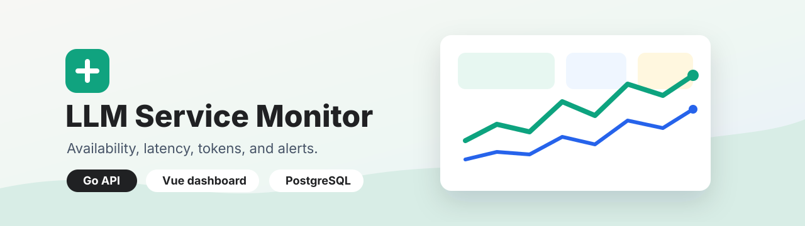
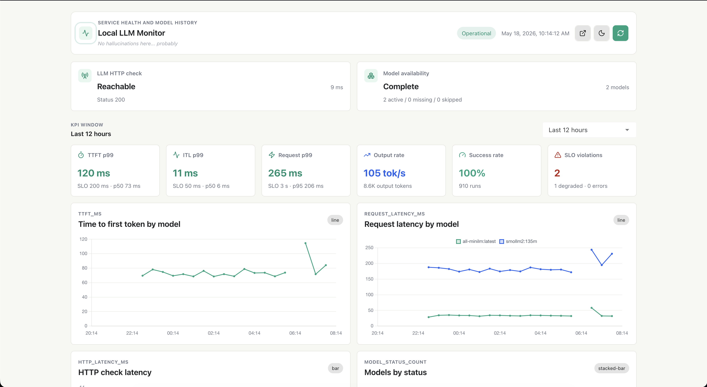

# LLM Service Monitor



Single-image monitor for OpenAI-compatible LLM services. The Go API, Asynq scheduler, and worker processes run scheduled probes through Redis, persist PostgreSQL history, send model lifecycle alerts by SMTP, and serve a Vue/Vuetify dashboard from embedded static assets.

## Screenshot



## Quick Start

```bash
docker compose up --build
```

Docker Compose starts PostgreSQL, Redis, the API server, scheduler, worker, and MailDev. It exposes the app at [http://localhost:18080](http://localhost:18080) and MailDev at [http://localhost:1080](http://localhost:1080). The sample compose config disables OAuth, sends SMTP alerts to MailDev on `maildev:1025`, and points the target at a local placeholder API. For a real target, copy [config.example.yaml](config.example.yaml), fill in the endpoint, auth, SMTP, and certificate settings, then mount secrets read-only.

## Development

```bash
go test ./...
cd web
npm install
npm run build
```

The production image builds the Vue app first, embeds `web/dist` into `cmd/server/static`, and then compiles a rootless Go runtime image.

## Documentation

- [Documentation index](docs/README.md)
- [Architecture](docs/architecture.md)
- [Configuration](docs/configuration.md)
- [Deployment](docs/deployment.md)
- [Operations](docs/operations.md)
- [Scheduled Tasks](docs/tasks/README.md)
- [API](docs/api.md)
- [Development](docs/development.md)
