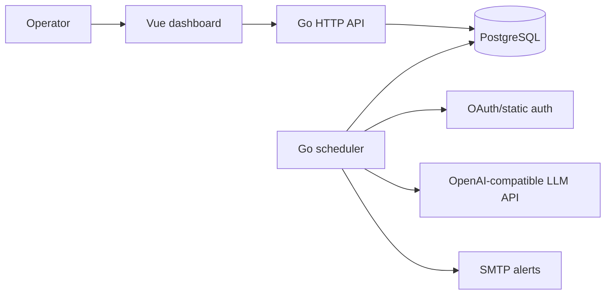

# Architecture

LLM Service Monitor is a single deployable service with three main layers:

- Go backend: configuration, OAuth/static auth, target probes, persistence, alerting, and HTTP API.
- PostgreSQL: model inventory snapshots, current state, probe runs, checks, events, and email alert records.
- Vue dashboard: a static SPA served by the Go binary.

## Backend Packages

- `internal/config`: YAML loading, defaults, validation, and mounted secret reads.
- `internal/auth`: static bearer tokens or OAuth2 client credentials with optional mTLS.
- `internal/llm`: target HTTP client, model listing, health checks, chat probes, streaming metrics, and embedding probes.
- `internal/store`: PostgreSQL connection, migrations, model inventory, events, checks, runs, alerts, and metrics.
- `internal/monitor`: recurring scheduler loops, capability detection, model runs, alert orchestration, and event recording.
- `internal/api`: HTTP routes, response contracts, dashboard aggregation, chart bucketing, query parsing, JSON, and static SPA serving.

## Data Flow

1. The scheduler lists `/v1/models` and classifies each model with embedding and chat probes.
2. The store writes a snapshot, updates current model state, and emits lifecycle events.
3. Runnable models are probed on the configured interval.
4. Check, run, token, latency, and event data are persisted.
5. The API aggregates the latest state for the dashboard.
6. Missing, returned, and first-seen model events can emit deduplicated SMTP alerts.

## Related Docs

- [Scheduled Tasks](tasks/README.md) expands each scheduler loop and its storage side effects.
- [API](api.md) documents the endpoints backed by the persisted monitor state.
- [Operations](operations.md) covers runtime health, alert behavior, and troubleshooting.
