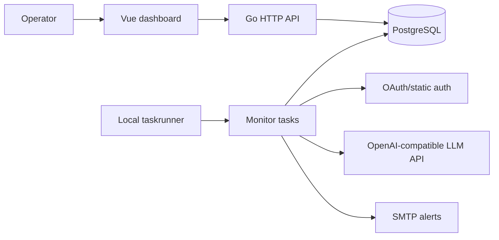

# Architecture

LLM Service Monitor is a single deployable service with three main layers:

- Go backend: configuration, OAuth/static auth, target probes, persistence, alerting, and HTTP API.
- PostgreSQL: model inventory snapshots, current state, probe runs, checks, events, and email alert records.
- Vue dashboard: a static SPA served by the Go binary.

## Backend Packages

- `internal/config`: YAML loading, defaults, validation, and mounted secret reads.
- `internal/auth`: static bearer tokens or OAuth2 client credentials with optional mTLS.
- `internal/llm`: target HTTP client, model listing, health checks, chat probes, streaming metrics, and embedding probes.
- `internal/store`: PostgreSQL connection, migrations, model inventory, events, checks, runs, alerts, and metrics.
- `internal/schedule`: scheduling module that groups runner infrastructure and monitor task handlers.
- `internal/schedule/runner`: generic task registry, invocation context, local recurring scheduler, retries, and timeouts.
- `internal/schedule/tasks`: monitor task facade, with handlers grouped under `checks`, `models`, `retention`, and shared task contracts in `shared`.
- `internal/api`: HTTP routes, response contracts, dashboard aggregation, chart bucketing, query parsing, JSON, and static SPA serving.

## Data Flow

1. The local taskrunner invokes `monitor.model_snapshot`, which lists the configured model endpoint and classifies each model with embedding and chat probes.
2. The store writes a snapshot, updates current model state, and emits lifecycle events.
3. The snapshot task updates the shared `ModelPlanStore`, then `monitor.model_runs` probes runnable models on the configured interval.
4. Check, run, token, latency, and event data are persisted.
5. The API aggregates the latest state for the dashboard.
6. Inactive, returned, and first-seen model events can emit deduplicated SMTP alerts.

## Task Execution

The production binary currently uses `internal/schedule/runner.LocalScheduler`, so
tasks execute in-process and share an in-memory `ModelPlanStore`. Each task has a
stable name and receives a serializable `TaskContext` containing `task_name`,
`run_id`, `attempt`, `scheduled_at`, and optional JSON payload. This keeps the
business handlers ready for a later distributed executor without introducing a
queue, leases, or task-run tables yet.

Task handlers are grouped by domain:

- `internal/schedule/tasks/checks`: target HTTP reachability and auth/token checks.
- `internal/schedule/tasks/models`: model snapshots, capability probes, scheduled model runs, lifecycle events, and alerts.
- `internal/schedule/tasks/retention`: persisted history pruning.
- `internal/schedule/tasks/shared`: stable task names, task dependencies, task repository/client contracts, and shared model-plan storage.

## Related Docs

- [Scheduled Tasks](tasks/README.md) expands each registered task and its storage side effects.
- [API](api.md) documents the endpoints backed by the persisted monitor state.
- [Operations](operations.md) covers runtime health, alert behavior, and troubleshooting.
